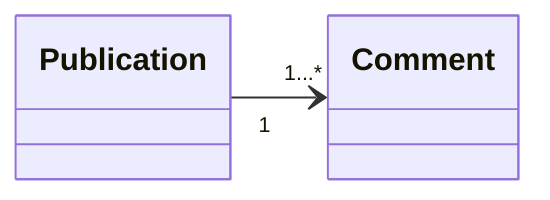

# SpringBoot ManyToOne example (Publication - Comment)

## Description
This repository contains an SpringBoot example of entity - relationship of many-to-one, using the unidirectional relationship between publications and comments.

## Technologies
SpringBoot, Java, Maven, Postman, Swagger-UI, Git, Markdown

## Execution
1. Create .env file with the following content:
```env
DB_URL=jdbc:mysql://localhost:3306/<database_name>
DB_USERNAME=<database_username>
DB_PASSWORD=<database_password>
```
2. From IntelliJ IDEA: run "Application" class.
3. Import SpringBoot.postman_collection.json to Postman or use Swagger-UI.

## API
### Endpoints
| Entity      | Method | Endpoint                   | Description                    |
|-------------|--------|----------------------------|--------------------------------|
| Publication | GET    | /publications              | List all publications          |
| Publication | POST   | /publications              | Create publication             |
| Publication | PUT    | /publications/{id}         | Update publication             |
| Publication | DELETE | /publications/{id}         | Delete publication             |
| Comment     | GET    | /comments                  | List all comments              |
| Comment     | GET    | /comments/{id}             | Get comment by ID              |
| Comment     | GET    | /comments/publication/{id} | Get comments by publication ID |
| Comment     | POST   | /comments                  | Create comment                 |
| Comment     | PUT    | /comments/{id}             | Update comment                 |
| Comment     | DELETE | /comments/{id}             | Delete comment                 |

### Swagger-UI
[Request List](http://localhost:8080/swagger-ui.html)
- ⚠️Watch out! For pageable requests, it is necessary to remove the parameter <code>"sort": ["string"]</code> .⚠️

## Tree structure:
```batch
...
├── src
│   └── main
│       ├── java
│       │   └── zzz.master.REST.publisher.MTO
│       │       ├── Controllers
│       │       │   ├── CommentController.java
│       │       │   └── PublicationController.java
│       │       ├── Entities
│       │       │   ├── AuditModel.java
│       │       │   ├── CommentEntity.java
│       │       │   └── PublicationEntity.java
│       │       ├── Exceptions
│       │       │   └── ResourceNotFoundException.java
│       │       ├── Repositories
│       │       │   ├── CommentRepository.java
│       │       │   └── PublicationRepository.java
│       │       └── Application.java
│       └── resources
│           └── application.properties
├── .env
├── pom.xml
├── README.md
└── SpringBoot.postman_collection.json
```

## Relation
